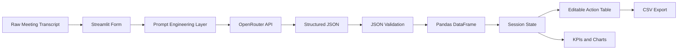

# ==============================================
# ActionOS - AI Meeting Intelligence
# MirAI School of Technology Capstone (Project #20)
# ==============================================

`Meeting transcript -> structured execution intelligence`

LIVE DEMO: https://actionos-meeting-ai.streamlit.app
SCREENSHOT: `ADD_SCREENSHOT_HERE`

## Product Overview
ActionOS is a production-style Streamlit SaaS application that converts messy meeting transcripts into:

- concise summary
- action items
- owners
- deadlines
- priorities
- statuses
- decisions
- risks/blockers
- follow-up recommendations

The extraction engine uses **OpenRouter Chat Completions API** with a configurable model constant (default: `openai/gpt-oss-20b`).

## Core Features
- Streamlit wide-layout dashboard with polished dark/cyber visual style
- `st.form`-based transcript submission to prevent rerun-triggered API calls
- Dynamic prompt engineering with meeting context controls
- Strict JSON parsing and schema normalization
- Editable action table via `st.data_editor`
- KPI metrics and workload visualizations
- Local filters (owner, priority, status)
- Session-local meeting history
- CSV export of edited action items
- Robust API/network/parsing error handling

## Architecture


## Tech Stack
- Python
- Streamlit
- Pandas
- Requests
- python-dotenv
- OpenRouter Chat Completions API

## Local Installation
1. Clone repository and move into project folder.
2. Create and activate a virtual environment.
3. Install dependencies.

```bash
pip install -r requirements.txt
```

## Environment Variable Setup
Create a local `.env` file:

```bash
OPENROUTER_API_KEY=your_key_here
```

Never commit `.env` to source control.

## Run Locally
```bash
streamlit run app.py
```

## How To Use
1. Open the app and choose meeting controls in the sidebar.
2. Paste transcript in the form (or load demo transcript).
3. Click **Analyze Meeting**.
4. Review summary, decisions, risks, and KPIs.
5. Edit action items in the data editor.
6. Filter, visualize, and export CSV.

## Streamlit Community Cloud Deployment
1. Push the `actionos/` project to GitHub.
2. Open Streamlit Community Cloud and click **New app**.
3. Select repository and branch.
4. Set **Main file path** to `app.py`.
5. Open **Advanced settings -> Secrets** and add:

```toml
OPENROUTER_API_KEY = "your_key_here"
```

6. Deploy.

## Security Notes
- AI Provider: **OpenRouter**
- No API keys hardcoded in code or docs
- `.gitignore` excludes `.env` and Streamlit secrets
- App never prints secret values

## Project Structure
```text
actionos/
|- app.py
|- requirements.txt
|- .gitignore
|- README.md
|- sample_transcript.txt
`- docs/
   `- technical_design.md
```

## Design Decisions
- Single-file app architecture to support 24-hour implementation and review.
- Strict JSON-first prompting for predictable parsing.
- Session-state persistence to avoid repeated model calls on UI changes.
- Minimal dependency footprint for cloud reliability.

## Limitations
- LLM output quality depends on transcript quality.
- Deadline interpretation may remain textual if transcript is vague.
- Session history is in-memory only (no database persistence).

## Future Improvements
- Add multi-meeting persistent workspace with authentication.
- Add calendar integration and ticket sync (Jira/Linear/Trello).
- Add confidence scoring per extracted action item.
- Add automated reminders for overdue tasks.

## Rubric Alignment Note
The internship rubric references Gemini in places. This implementation intentionally uses **OpenRouter** as the selected provider and does not claim Gemini integration.
