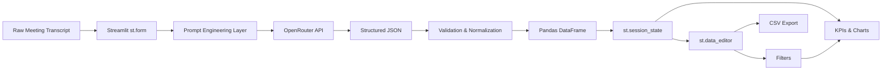

# ⚡ ActionOS — AI Meeting Intelligence

```text
┌──────────────────────────────────────────────────────────────┐
│  ACTIONOS // MEETING INTELLIGENCE ENGINE                    │
├──────────────────────────────────────────────────────────────┤
│  INPUT  :: Chaotic Meeting Transcript                      │
│  ENGINE :: OpenRouter + Structured JSON                    │
│  STATE  :: Streamlit Session State                         │
│  DATA   :: Pandas                                          │
│  OUTPUT :: Decisions • Risks • Owners • Tasks • Analytics  │
└──────────────────────────────────────────────────────────────┘

> SYSTEM STATUS: ONLINE
> BUILD: MirAI School of Technology — Capstone Project #20
```

<p align="center">
  <strong>Meeting transcript in. Structured accountability out.</strong>
</p>

<p align="center">
  <a href="https://actionos-meeting-ai.streamlit.app">
    
  </a>
  
  
  
</p>

---

## `> cat product_overview.txt`

ActionOS is an AI-powered meeting intelligence dashboard that converts unstructured meeting transcripts into execution-ready information.

It extracts and organizes:

- Meeting summaries
- Action items
- Explicit task owners
- Deadlines
- Priority levels
- Task statuses
- Key decisions
- Risks and blockers
- Follow-up recommendations

The system uses OpenRouter as its AI inference provider and transforms structured model output into an editable Pandas workflow inside Streamlit.

---

## `> ./features --list`

- `st.form` prevents unnecessary AI calls during widget reruns.
- `st.session_state` preserves analysis and edited tasks.
- Context-aware system prompting adapts to meeting type and detail level.
- Strict JSON extraction with validation and normalization.
- Ownership guardrails prevent the model from assigning tasks based only on who mentioned them.
- `st.data_editor` provides an interactive action-item workspace.
- Dynamic KPI cards display task volume, priority, ownership, and productivity.
- Local filters for owner, priority, and task status.
- Priority, workload, and status visualizations.
- Completion, blocked-task, and unassigned-task accountability metrics.
- Session-local meeting analysis history.
- Editable action items export directly to CSV.
- Graceful handling of API, network, timeout, empty-response, and JSON failures.
- Demo transcript loader for instant evaluation.

---

## `> architecture --render`



### Data Flow

```text
Transcript
    │
    ▼
Streamlit Form
    │
    ▼
Dynamic System Prompt
    │
    ▼
OpenRouter LLM
    │
    ▼
Strict JSON Response
    │
    ▼
JSON Validation
    │
    ▼
Pandas DataFrame
    │
    ▼
Session State
    ├──► Editable Action Table
    ├──► KPI Metrics
    ├──► Filters
    ├──► Visualizations
    └──► CSV Export
```

A complete engineering breakdown is available in:

[`docs/technical_design.md`](docs/technical_design.md)

---

## `> stack --verbose`

```text
LANGUAGE       Python
FRONTEND       Streamlit
DATA LAYER     Pandas
HTTP CLIENT    Requests
AI PROVIDER    OpenRouter
MODEL          openai/gpt-oss-20b
CONFIG         python-dotenv
DEPLOYMENT     Streamlit Community Cloud
VERSION CTRL   Git + GitHub
```

The internship rubric references Gemini as the suggested AI provider. ActionOS intentionally uses OpenRouter as its inference provider and documents that implementation transparently.

---

## `> intelligence --explain`

ActionOS does not use the AI as a generic chatbot.

The system prompt instructs the model to operate as a dedicated Meeting Intelligence Engine.

Important extraction rules include:

```text
1. Never invent task owners.
2. Mentioning a task does not imply ownership.
3. Use "Unassigned" when ownership is unclear.
4. Use "Not specified" when no deadline exists.
5. Separate decisions from action items.
6. Detect blockers and risks independently.
7. Preserve participant names exactly.
8. Keep extracted tasks concise.
9. Return strict JSON only.
10. Avoid unsupported facts.
```

The resulting JSON is validated and normalized in Python before entering the dashboard.

---

## `> metrics --show`

ActionOS generates four primary meeting KPIs:

```text
Total Action Items
High / Critical Tasks
Assigned Owners
Productivity Score
```

Additional accountability metrics include:

```text
Completion Percentage
Blocked Tasks
Unassigned Tasks
```

Task edits immediately update these metrics without making another AI API request.

---

## `> workspace --interactive`

Extracted action items are converted into a Pandas DataFrame with the schema:

```text
Task
Owner
Deadline
Priority
Status
```

Users can modify the table through `st.data_editor`.

Supported priorities:

```text
Low
Medium
High
Critical
```

Supported statuses:

```text
Not Started
In Progress
Blocked
Completed
```

Edits persist through `st.session_state` and are reflected in metrics, charts, filtering, and CSV exports.

---

## `> git clone && ./setup`

### 1. Clone

```bash
git clone https://github.com/coderajnish/actionos-ai-meeting-intelligence.git
cd actionos-ai-meeting-intelligence
```

### 2. Create virtual environment

Windows:

```bash
python -m venv .venv
.venv\Scripts\activate
```

macOS/Linux:

```bash
python3 -m venv .venv
source .venv/bin/activate
```

### 3. Install dependencies

```bash
python -m pip install -r requirements.txt
```

### 4. Configure OpenRouter

Create:

```text
.env
```

Add:

```env
OPENROUTER_API_KEY=your_key_here
```

Never commit this file.

### 5. Launch

```bash
python -m streamlit run app.py
```

Then visit:

```text
http://localhost:8501
```

---

## `> usage --help`

```text
1. Select the meeting type from the sidebar.
2. Choose the desired AI detail level.
3. Paste a raw meeting transcript or load the demo.
4. Click "Analyze Meeting".
5. Review meeting health and summary.
6. Inspect decisions, risks, and recommendations.
7. Edit extracted tasks directly in the action table.
8. Filter by owner, priority, or status.
9. Monitor workload and accountability metrics.
10. Download the edited action-item CSV.
```

---

## `> tree`

```text
actionos-ai-meeting-intelligence/
│
├── docs/
│   └── technical_design.md
│
├── .gitignore
├── app.py
├── README.md
├── requirements.txt
└── sample_transcript.txt
```

Secrets are intentionally excluded from source control.

---

## `> deploy --streamlit-cloud`

1. Push the project to GitHub.
2. Open Streamlit Community Cloud.
3. Select:

```text
Repository:
coderajnish/actionos-ai-meeting-intelligence

Branch:
main

Main file:
app.py
```

4. Open Advanced Settings → Secrets.
5. Add:

```toml
OPENROUTER_API_KEY = "your_key_here"
```

6. Select a compatible Python runtime such as Python 3.11.
7. Deploy.

---

## `> security --audit`

```text
[✓] No hardcoded API keys
[✓] .env excluded through .gitignore
[✓] Streamlit secrets excluded
[✓] Secret values never rendered in the UI
[✓] API requests use timeouts
[✓] HTTP errors handled gracefully
[✓] Malformed AI JSON handled safely
[✓] No eval() used for AI output
```

---

## `> failure_strategy`

ActionOS assumes external APIs can fail.

Handled conditions include:

- Missing API credentials
- Empty transcripts
- Very short transcripts
- Network connection failures
- API timeouts
- OpenRouter HTTP errors
- Empty model responses
- Truncated/incomplete model responses
- Invalid JSON responses
- Missing structured fields
- Empty action-item datasets
- Missing demo transcript

Instead of exposing raw Python tracebacks, the application presents user-friendly Streamlit feedback.

---

## `> design_decisions`

### Why `st.form`?

It prevents API calls from firing every time a Streamlit widget reruns the application.

### Why `st.session_state`?

It preserves AI results and edited tasks across Streamlit reruns.

### Why structured JSON?

A deterministic schema allows model output to become application data rather than unstructured chatbot text.

### Why Pandas?

It provides a clean transformation layer between AI JSON, editable tables, filters, charts, metrics, and CSV output.

### Why a single-file application?

For a time-constrained capstone, a focused `app.py` keeps deployment simple while functions maintain separation of concerns.

---

## `> known_limitations`

- AI extraction accuracy depends on transcript quality.
- Ambiguous human language can still produce uncertain task interpretation.
- Relative deadlines such as "next week" remain textual.
- Session history is stored in memory rather than a persistent database.
- External AI availability depends on OpenRouter and its model providers.

---

## `> roadmap`

```text
[ ] Persistent user accounts and meeting workspaces
[ ] Jira / Linear / Trello synchronization
[ ] Calendar deadline synchronization
[ ] Per-task AI confidence scoring
[ ] Meeting audio transcription
[ ] Automated reminders
[ ] Team analytics across multiple meetings
```

---

## `> project_context`

Built as Capstone Project #20 — Meeting Action-Item Extractor for the MirAI School of Technology Virtual Summer Internship 2026, AI Builder Track.

The project focuses on converting AI output into a reliable, editable, and deployable software workflow rather than building another generic chatbot.

---

```text
ACTIONOS STATUS
────────────────────────────────────────
AI Engine .............. ONLINE
Structured Extraction .. ENABLED
Session Memory .......... ACTIVE
Editable Workspace ...... READY
Cloud Deployment ........ READY
────────────────────────────────────────
```
