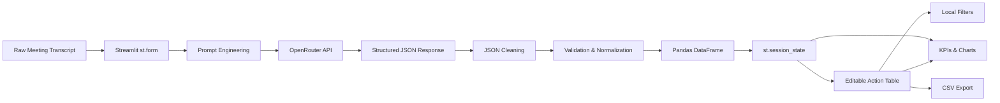

# ActionOS — Technical Design Document

> AI Meeting Intelligence Architecture  
> MirAI School of Technology — Capstone Project #20

---

## 1. Problem Statement

Meeting transcripts are naturally noisy and unstructured. Decisions, responsibilities, deadlines, risks, and follow-up actions are often distributed across a long conversation.

This creates several execution problems:

- Tasks are forgotten after meetings.
- Ownership can remain ambiguous.
- Deadlines are difficult to track.
- Decisions become buried inside conversation.
- Blockers may not be formally documented.
- Manually converting transcripts into task trackers requires additional time.

ActionOS converts a raw meeting transcript into structured, editable execution intelligence.

The application is designed as an AI-assisted workflow rather than a generic chatbot.

---

## 2. Functional Requirements

ActionOS must:

- Accept raw meeting transcripts through a controlled `st.form`.
- Accept meeting metadata through configurable sidebar controls.
- Send transcript context to an AI extraction engine.
- Receive structured JSON instead of free-form conversational text.
- Parse and validate the returned JSON safely.
- Extract:
  - meeting summary
  - sentiment
  - productivity score
  - decisions
  - risks and blockers
  - follow-up recommendation
  - action items
  - owners
  - deadlines
  - priorities
  - statuses
- Convert action items into a Pandas DataFrame.
- Persist results through `st.session_state`.
- Allow direct editing through `st.data_editor`.
- Filter tasks locally without additional AI requests.
- Generate KPI metrics and visualizations.
- Track task completion and accountability.
- Export edited action items to CSV.
- Maintain lightweight session-local analysis history.
- Fail gracefully when external services or model responses are invalid.

---

## 3. High-Level Architecture

ActionOS uses a layered architecture:

```text
┌───────────────────────────────────────────┐
│               USER / BROWSER              │
└─────────────────────┬─────────────────────┘
                      │
                      ▼
┌───────────────────────────────────────────┐
│          STREAMLIT PRESENTATION LAYER     │
│                                           │
│  st.form          st.metric               │
│  st.data_editor   st.expander             │
│  st.bar_chart     st.download_button      │
└─────────────────────┬─────────────────────┘
                      │
                      ▼
┌───────────────────────────────────────────┐
│           ORCHESTRATION LAYER             │
│                                           │
│  Prompt Builder                           │
│  API Client                               │
│  JSON Cleaner                             │
│  JSON Validator                           │
│  Action Item Normalizer                   │
└─────────────────────┬─────────────────────┘
                      │
            ┌─────────┴─────────┐
            ▼                   ▼
┌──────────────────────┐  ┌─────────────────┐
│     OPENROUTER       │  │  PANDAS / STATE │
│                      │  │                 │
│  gpt-oss-20b         │  │ DataFrame       │
│  Structured JSON     │  │ Session State   │
└──────────────────────┘  └─────────────────┘
```

The system intentionally separates AI extraction from local interaction.

The AI is called only when a meeting is submitted. Editing, filtering, charting, and exporting happen locally.

---

## 4. Mermaid Architecture Diagram



---

## 5. Data Flow

The primary request flow is:

```text
User Transcript
      │
      ▼
Streamlit Form
      │
      ▼
Input Validation
      │
      ▼
Context-Aware System Prompt
      │
      ▼
OpenRouter Chat Completions API
      │
      ▼
Raw AI Response
      │
      ▼
JSON Cleaning
      │
      ▼
JSON Parsing
      │
      ▼
Schema Validation & Normalization
      │
      ▼
Pandas DataFrame
      │
      ▼
Session State
      │
      ├──► Editable Action Items
      ├──► Local Filters
      ├──► KPI Metrics
      ├──► Visualizations
      ├──► Accountability Metrics
      └──► CSV Export
```

After the initial AI request, subsequent UI interactions do not require another model request.

---

## 6. Streamlit Form Strategy

The transcript input is wrapped inside:

```python
st.form()
```

This is an intentional architectural decision.

Streamlit reruns a Python application whenever users interact with widgets. Without a form, ordinary input changes could trigger expensive processing logic.

With `st.form`:

1. Users configure their meeting.
2. Users enter or paste the transcript.
3. The application waits.
4. The API pipeline runs only when **Analyze Meeting** is submitted.

This reduces unnecessary AI requests and provides predictable execution behavior.

---

## 7. Session-State Strategy

ActionOS uses `st.session_state` as its in-memory application state.

Primary keys include:

```text
analysis
action_items
meeting_history
current_transcript
selected_meeting_title
raw_model_response
```

### `analysis`

Stores the normalized AI analysis, including:

- summary
- sentiment
- productivity score
- decisions
- risks
- follow-up recommendation

### `action_items`

Stores the editable Pandas DataFrame.

This is especially important because changes made through `st.data_editor` must survive Streamlit reruns.

### `meeting_history`

Stores lightweight metadata for recent meeting analyses during the current browser session.

### `current_transcript`

Preserves transcript state.

### `selected_meeting_title`

Preserves the active meeting title.

### `raw_model_response`

Used only for controlled debugging when parsing fails.

The session-state architecture prevents repeated model calls during:

- task editing
- filtering
- chart interaction
- CSV export
- metric updates

---

## 8. AI Integration Strategy

### Provider

OpenRouter Chat Completions API

### Endpoint

```text
https://openrouter.ai/api/v1/chat/completions
```

### Current Model

```text
openai/gpt-oss-20b
```

The model is stored as a Python constant so it can be changed without rewriting API logic.

### Authentication

```text
Authorization: Bearer OPENROUTER_API_KEY
```

The API key is never embedded directly in application source code.

### HTTP Client

```text
requests
```

### Request Timeout

```text
60 seconds
```

A finite timeout prevents requests from hanging indefinitely.

---

## 9. Prompt Engineering Strategy

The AI is assigned a specialized role:

```text
ActionOS Meeting Intelligence Engine
```

It is not prompted as a general assistant.

The system prompt contains dynamic context:

- meeting type
- AI detail level
- current date
- default deadline horizon

This allows extraction behavior to adapt to the meeting context.

### Anti-Hallucination Rules

The prompt explicitly instructs the model:

```text
Never invent facts.

Never invent owners.

Mentioning a task does not imply ownership.

Only assign an owner if the transcript explicitly indicates
that the person owns, accepts, or will perform the task.

Otherwise use "Unassigned".

If no deadline exists, use "Not specified".

Preserve participant names exactly as written.
```

The explicit ownership rule was added because naive meeting extraction can incorrectly assign a task to the person who merely mentioned it.

Example:

```text
Sara: Someone should contact the payment provider.
```

Correct extraction:

```text
Owner: Unassigned
```

Not:

```text
Owner: Sara
```

---

## 10. Output-Control Strategy

Structured LLM responses can become unreliable if unnecessarily verbose.

ActionOS therefore constrains output:

- Summary: maximum 80 words
- Follow-up: maximum 50 words
- Decisions: maximum 25 words each
- Risks: maximum 25 words each
- Tasks: maximum 20 words each
- Maximum action items: 10

The application currently allows up to:

```text
4000 output tokens
```

This combination reduces the chance of truncated JSON while keeping model output useful.

---

## 11. JSON Contract

The AI is required to produce one JSON object with this conceptual schema:

```json
{
  "meeting_summary": "string",
  "sentiment": "Positive | Neutral | Tense | Mixed",
  "productivity_score": 0,
  "decisions": [
    "decision"
  ],
  "risks": [
    "risk"
  ],
  "follow_up": "string",
  "action_items": [
    {
      "task": "string",
      "owner": "string",
      "deadline": "string",
      "priority": "Low | Medium | High | Critical",
      "status": "Not Started"
    }
  ]
}
```

The productivity score is normalized to:

```text
0–100
```

---

## 12. JSON Processing Pipeline

Raw model output is never trusted directly.

The processing pipeline is:

```text
Raw AI Text
    │
    ▼
Remove Markdown Fences
    │
    ▼
Locate JSON Object
    │
    ▼
json.loads()
    │
    ▼
Validate Top-Level Object
    │
    ▼
Normalize Fields
    │
    ▼
Normalize Action Items
    │
    ▼
Pandas DataFrame
```

The application never uses:

```python
eval()
```

for model output.

This avoids executing arbitrary generated Python expressions.

---

## 13. Data Model

After normalization, action items are converted into a Pandas DataFrame with five columns:

```text
Task
Owner
Deadline
Priority
Status
```

Allowed priorities:

```text
Low
Medium
High
Critical
```

Allowed statuses:

```text
Not Started
In Progress
Blocked
Completed
```

Invalid or unknown priority/status values are normalized to safe defaults.

---

## 14. Editable Workspace

`st.data_editor` serves as the operational task workspace.

Users can change:

- task descriptions
- owners
- deadlines
- priority
- status

Edits are stored back into session state.

This means ActionOS combines AI extraction with human review rather than treating AI output as unquestionable ground truth.

This human-in-the-loop model is important because meeting language can be ambiguous.

---

## 15. KPI Strategy

The dashboard displays:

```text
Total Action Items
High / Critical Tasks
Assigned Owners
Productivity Score
```

Additional accountability indicators include:

```text
Completion Percentage
Blocked Tasks
Unassigned Tasks
```

The Completion Percentage is derived directly from the edited action-item DataFrame.

For example:

```text
1 completed task / 5 total tasks = 20%
```

Because metrics use the edited DataFrame, they respond immediately to user changes without another AI call.

---

## 16. Visualization Strategy

ActionOS visualizes:

### Priority Distribution

Shows workload concentration across:

```text
Low
Medium
High
Critical
```

### Owner Workload

Shows how many tasks are assigned to each owner.

### Status Distribution

Shows task progress across:

```text
Not Started
In Progress
Blocked
Completed
```

The charts operate on the complete edited task dataset.

Local filters affect the filtered action-item view without destroying the overall meeting-intelligence visualization.

---

## 17. Local Filtering Strategy

Users can filter tasks by:

- Owner
- Priority
- Status

Filtering uses Pandas locally.

No additional OpenRouter request is made.

This keeps the application responsive and minimizes AI API usage.

---

## 18. CSV Export

The current edited DataFrame is converted using:

```python
DataFrame.to_csv()
```

The user can download:

```text
actionos_action_items.csv
```

The downloaded file contains the user's latest edits, not merely the original AI extraction.

---

## 19. Failure Handling

ActionOS assumes external services can fail.

Handled conditions include:

### Input failures

- Empty transcript
- Transcript below minimum length

### Configuration failures

- Missing OpenRouter API key

### Network failures

- Connection errors
- API timeout
- General request errors

### API failures

- HTTP errors
- OpenRouter error objects
- Missing choices
- Empty model content

### Structured-output failures

- Markdown-wrapped JSON
- Malformed JSON
- Incomplete JSON
- Missing fields
- Unexpected priority/status values
- Empty action-item collections

Failures are shown through Streamlit components such as:

```text
st.error
st.warning
st.info
st.toast
st.expander
```

Normal failure conditions do not intentionally expose raw Python tracebacks to users.

---

## 20. Security Architecture

Secrets are loaded through:

```text
Local Development:
.env

Production:
Streamlit Secrets
```

The repository `.gitignore` excludes:

```text
.env
__pycache__/
*.pyc
.streamlit/secrets.toml
```

The application:

- does not hardcode API credentials
- does not render API credentials
- does not log credentials
- does not place secrets in client-side URLs

---

## 21. Deployment Architecture

ActionOS is designed for direct deployment to:

```text
Streamlit Community Cloud
```

Production architecture:

```text
GitHub Repository
        │
        ▼
Streamlit Community Cloud
        │
        ├── app.py
        ├── requirements.txt
        └── Streamlit Secrets
                  │
                  ▼
             OpenRouter API
```

The application uses a minimal dependency set and avoids operating-system-specific packages.

Main entry point:

```text
app.py
```

---

## 22. Dependency Strategy

The project intentionally uses a small dependency footprint:

```text
streamlit
pandas
requests
python-dotenv
```

Benefits:

- Faster cloud builds
- Lower dependency-conflict risk
- Easier local setup
- Better deployment portability

---

## 23. Design Decisions

### Single-file Streamlit architecture

A modular single-file design was selected because the capstone was implemented under a limited development window.

Function-level separation maintains readability while avoiding unnecessary package complexity.

### Structured JSON instead of free text

The AI response becomes application data.

This makes it possible to build:

- DataFrames
- editable tables
- charts
- filters
- metrics
- exports

### Human-in-the-loop editing

The AI performs extraction, but users retain control over the final task data.

### Session-local state instead of database persistence

This keeps the prototype lightweight and suitable for Streamlit Community Cloud while still demonstrating stateful architecture.

---

## 24. Test Strategy

ActionOS was tested against multiple transcript types.

### Test Case 1 — Structured Sprint Meeting

Validated:

- explicit ownership
- deadlines
- decisions
- blockers
- unassigned tasks

### Test Case 2 — Ambiguous Ownership

Validated that the engine does not automatically assign tasks to the speaker who mentioned them.

### Test Case 3 — Emergency Client Meeting

Validated:

- messy conversational input
- conditional commitments
- blocker extraction
- launch-risk identification
- decision extraction

Interactive behavior was additionally tested for:

- status editing
- completion percentage updates
- filtering
- CSV download
- session reset

---

## 25. Known Limitations

- LLM extraction depends on transcript quality.
- Extremely ambiguous responsibility statements may require human review.
- Relative deadlines remain textual rather than automatically becoming calendar dates.
- Session history is memory-only.
- No authentication or multi-user persistence is currently implemented.
- OpenRouter availability depends on upstream model providers.

---

## 26. Future Improvements

Potential production extensions include:

- Persistent PostgreSQL storage
- Authentication
- Multi-tenant team workspaces
- Per-task confidence scores
- Calendar integration
- Jira / Linear / Trello synchronization
- Automated reminders
- Meeting audio transcription
- Multi-language transcripts
- Historical team productivity analytics
- Audit logs for task changes

---

## 27. Engineering Summary

ActionOS demonstrates an end-to-end AI application pipeline:

```text
Unstructured Human Conversation
              │
              ▼
       Prompt Engineering
              │
              ▼
       AI Structured Output
              │
              ▼
        JSON Validation
              │
              ▼
          Pandas Data
              │
              ▼
      Stateful Streamlit UI
              │
              ▼
   Human-Editable Intelligence
```

The key engineering principle is:

> AI generates the first structured interpretation; deterministic Python validation and human review turn that interpretation into usable application state.

---

## 28. Project Context

ActionOS was developed for:

```text
MirAI School of Technology
Virtual Summer Internship 2026
AI Builder Track
Capstone Project #20
Meeting Action-Item Extractor
```

AI inference is implemented through OpenRouter and documented transparently.
